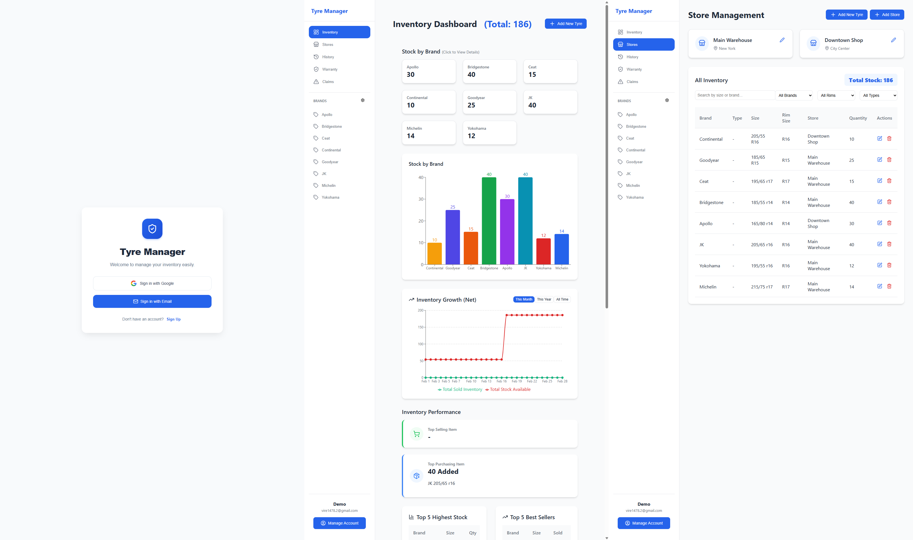
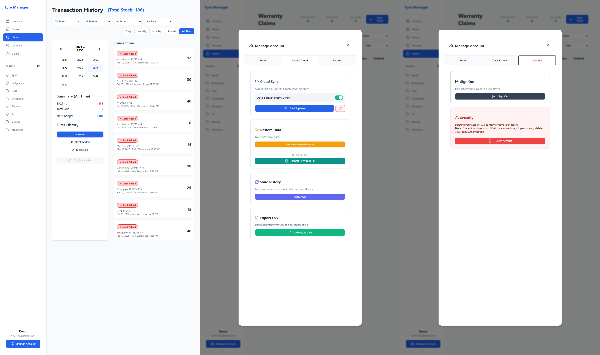

# 🚗 Tyre Inventory Manager

[](https://reactjs.org/)
[](https://www.typescriptlang.org/)
[](https://vitejs.dev/)

> A modern, efficient inventory management system specifically designed for tyre businesses. Built with React, TypeScript, and Vite for lightning-fast performance and excellent developer experience.

---

## 🎯 Overview

**Tyre Manager** is a comprehensive web application designed to streamline tyre inventory management for automotive businesses, dealerships, and tyre shops. The system provides real-time inventory tracking, stock management, and business analytics in a user-friendly interface.

### Why This Project?

Managing tyre inventory manually is time-consuming and error-prone. This application solves common challenges:
- ✅ Real-time stock level monitoring
- ✅ Automated low-stock alerts
- ✅ Easy search and filter capabilities
- ✅ Quick data entry and updates
- ✅ Professional reporting and analytics

---

## 📊 Previews




---

## ✨ Features

### Core Functionality
- 📦 **Inventory Management**
  - Add, edit, and delete tyre records
  - Track stock quantities in real-time
  - Categorize by brand, size, type, and model
  - Monitor the monthly warrantees and claims and their status information

- 🔍 **Search & Filter**
  - Advanced search functionality
  - Filter by multiple criteria (brand, size, season, etc.)
  - Sort by price, quantity, or date added
  - Quick lookup by tyre code/SKU

- 📊 **Analytics & Reports**
  - Stock level overview dashboard
  - Low inventory alerts
  - Sales trends and analytics
  - Export reports to CSV/PDF

- 💼 **Business Management**
  - Supplier contact management
  - Purchase order tracking
  - Price history tracking
  - Profit margin calculations

### Technical Features
- ⚡ **Lightning Fast** - Built with Vite for instant HMR (Hot Module Replacement)
- 🎨 **Modern UI** - Clean, responsive design that works on all devices
- 🔒 **Type-Safe** - Full TypeScript implementation for reliability
- 🎯 **Optimized** - Production-ready with code splitting and lazy loading
- 📱 **Responsive** - Mobile-first design approach

---

## 🛠️ Tech Stack

### Frontend
- **Framework:** React 18+
- **Language:** TypeScript 5.0+
- **Build Tool:** Vite 5.0+
- **Styling:** CSS3 / CSS Modules (customizable)
- **Linting:** ESLint

### Development Tools
- **Package Manager:** npm / yarn / pnpm
- **Version Control:** Git & GitHub
- **Code Quality:** ESLint + TypeScript strict mode

---

## 📁 Project Structure

```
tyreinventorymanager/
├── public/                 # Static assets
│   └── favicon.ico        # App icon
├── src/                   # Source code
│   ├── components/        # React components
│   │   ├── Dashboard/    # Dashboard components
│   │   ├── Inventory/    # Inventory management
│   │   ├── Reports/      # Reporting components
│   │   └── shared/       # Reusable components
│   ├── hooks/            # Custom React hooks
│   ├── types/            # TypeScript type definitions
│   ├── utils/            # Helper functions
│   ├── styles/           # Global styles
│   ├── App.tsx           # Main App component
│   ├── main.tsx          # Application entry point
│   └── vite-env.d.ts     # Vite type definitions
├── .env                  # Environment variables (not tracked)
├── .env.example          # Environment variables template
├── .gitignore            # Git ignore rules
├── eslint.config.js      # ESLint configuration
├── index.html            # HTML entry point
├── package.json          # Project dependencies
├── tsconfig.json         # TypeScript base config
├── tsconfig.app.json     # TypeScript app config
├── tsconfig.node.json    # TypeScript Node config
├── vite.config.ts        # Vite configuration
└── README.md             # This file
```

---

## 🚀 Getting Started

### Prerequisites

Ensure you have the following installed on your system:

- **Node.js** (version 18.0 or higher)
- **npm** (comes with Node.js) or **yarn** or **pnpm**
- **Git** (for cloning the repository)

### Installation

1. **Clone the repository**
   ```bash
   git clone https://github.com/parmesh-kumar-ai/tyreinventorymanager.git
   cd tyreinventorymanager
   ```

2. **Install dependencies**
   ```bash
   npm install
   # or
   yarn install
   # or
   pnpm install
   ```

3. **Set up environment variables**
   ```bash
   cp .env.example .env
   ```
   
   Edit `.env` file and add your configuration:
   ```env
   VITE_API_URL=your_api_url_here
   VITE_APP_NAME=Tyre Inventory Manager
   # Add other environment variables as needed
   ```

4. **Start the development server**
   ```bash
   npm run dev
   # or
   yarn dev
   # or
   pnpm dev
   ```

5. **Open your browser**
   
   Navigate to [http://localhost:5173](http://localhost:5173) to see the application!

---

## 🔨 Available Scripts

| Command | Description |
|---------|-------------|
| `npm run dev` | Start development server with HMR on `localhost:5173` |
| `npm run build` | Build the production-ready application |
| `npm run preview` | Preview the production build locally |
| `npm run lint` | Run ESLint to check code quality |
| `npm run type-check` | Run TypeScript compiler to check types |

---

## 🔐 Environment Variables

The application uses environment variables for configuration. Create a `.env` file based on `.env.example`:

```env
# API Configuration
VITE_API_URL=http://localhost:3000/api
VITE_API_KEY=your_api_key_here

# Application Settings
VITE_APP_NAME=Tyre Inventory Manager
VITE_APP_VERSION=1.0.0

# Feature Flags
VITE_ENABLE_ANALYTICS=true
VITE_ENABLE_REPORTS=true
```

**Note:** All environment variables must be prefixed with `VITE_` to be accessible in the client-side code.

---

## 📖 Usage Guide

### Adding New Inventory

1. Click the **"Add New Tyre"** button on the dashboard
2. Fill in the required information:
   - Purchase Date
   - Store/Shop (e.g., Shop1, Shop2, Store1, Store2)
   - Brand (e.g., Michelin, Bridgestone, Goodyear)
   - Model (e.g., Pilot Sport 4)
   - Size (e.g., 225/45R17)
   - Quantity in stock
3. Click **"Save"** to add to inventory

### Searching Inventory

- Use the search bar to find tyres by brand, model, or size
- Apply filters for quick categorization
- Click on any item to view detailed information

### Managing Stock

- Update quantities when tyres are sold or received
- Set low-stock alerts notifications in Dashboard
- Generate reports for accounting and analysis

---

## 🎨 Customization

### Styling

The application uses modular CSS. To customize the appearance:

1. Edit global styles in `src/styles/globals.css`
2. Modify component-specific styles in their respective CSS files
3. Update color scheme in CSS variables:

```css
:root {
  --primary-color: #0506A1;
  --secondary-color: #646cff;
  --background-color: #ffffff;
  --text-color: #213547;
}
```

### Adding New Features

1. Create new components in `src/components/`
2. Add type definitions in `src/types/`
3. Create custom hooks in `src/hooks/`
4. Update routing if needed

---

## 🔧 Build and Deployment

### Building for Production

```bash
npm run build
```

This creates an optimized production build in the `dist/` directory.

### Preview Production Build

```bash
npm run preview
```

### Deployment Options

**Vercel (Recommended)**
1. Push your code to GitHub
2. Import project in Vercel
3. Configure environment variables
4. Deploy automatically

**Netlify**
1. Connect your GitHub repository
2. Build command: `npm run build`
3. Publish directory: `dist`
4. Add environment variables
5. Deploy

**Other Options**
- AWS Amplify
- GitHub Pages
- Railway
- Self-hosted with Nginx/Apache

---

## 🤝 Contributing

Contributions are welcome! Here's how you can help:

1. **Fork the repository**
2. **Create a feature branch**
   ```bash
   git checkout -b feature/AmazingFeature
   ```
3. **Commit your changes**
   ```bash
   git commit -m 'Add some AmazingFeature'
   ```
4. **Push to the branch**
   ```bash
   git push origin feature/AmazingFeature
   ```
5. **Open a Pull Request**

---

## 📄 License

This project is licensed under the **MIT License** - see the [LICENSE](LICENSE) file for details.

---

<div align="center">

**"Manage your tyre inventory easily and efficiently!"**

[⬆ Back to Top](#-tyre-inventory-manager)

</div>
